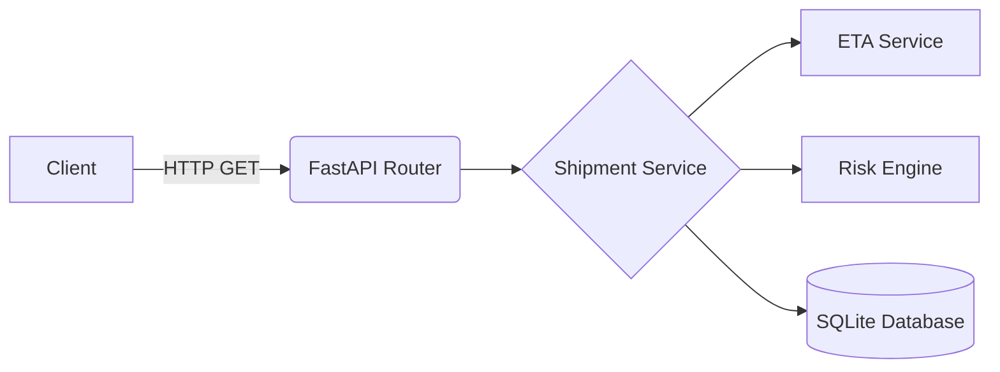

# Shipment Tracking API

## Overview

In the fast-paced freight and logistics industry, maintaining real-time visibility over international shipments is critical. This Shipment Tracking API solves the problem of data fragmentation by providing a single, unified REST endpoint. It aggregates shipment status, dynamically estimates delivery times, and proactively flags operational risks—allowing logistics operators and end-clients to monitor their cargo seamlessly.

## Assessment Requirement

This project satisfies the primary requirement for Task 3:

> "A REST endpoint accepts a shipment tracking request and returns current status, estimated delivery date, and risk flags."

The implementation successfully achieves this by integrating a robust routing layer with independent ETA calculation and Risk evaluation services, returning a clean, unified JSON response.

## Architecture

The API follows a clean, modular, layered architecture to separate routing concerns from business logic:



## Features

- **Shipment tracking**: Look up records securely via unique tracking numbers.
- **Current status**: Fetch the real-time documented status (e.g., `IN_TRANSIT`, `CUSTOMS_CLEARANCE`).
- **ETA estimation**: Transparent calculation of delivery dates based on the current milestone.
- **Risk detection**: Automated flagging of documentation or logistical delays.
- **Validation**: Strict input validation using Pydantic (e.g., minimum tracking number lengths).
- **Error handling**: Proper HTTP response codes (404 Not Found, 422 Unprocessable Entity, 500 Internal Server Error).
- **OpenAPI documentation**: Autogenerated, interactive Swagger UI and ReDoc.

## API Endpoint

### `GET /api/shipments/{tracking_number}`

**Example Request:**
```bash
curl -X 'GET' \
  'http://127.0.0.1:8000/api/shipments/TRK-URGENT-02' \
  -H 'accept: application/json'
```

**Example Successful Response (200 OK):**
```json
{
  "tracking_number": "TRK-URGENT-02",
  "client_name": "Global Trade LLC",
  "origin": "Rotterdam, Netherlands",
  "destination": "New York, USA",
  "cargo_type": "Machinery Parts",
  "weight_kg": 2500.5,
  "value_usd": 85000.0,
  "status": "DOCUMENTS_PENDING",
  "booking_date": "2026-08-16T18:29:56.552000",
  "vessel_berth_date": "2026-09-09T18:29:56.552000",
  "documents_lodged": false,
  "estimated_arrival_date": "2026-09-19T18:29:56.552000",
  "actual_delivery_date": null,
  "risk_flags": [
    {
      "code": "DOCUMENTS_NOT_LODGED",
      "severity": "HIGH",
      "message": "Required documents have not been lodged and vessel berths in 4 days."
    }
  ],
  "estimated_delivery_date": "2026-09-02T18:29:56.552000"
}
```

## Risk Detection

The API incorporates a deterministic, rules-based risk engine (`app/services/risk_engine.py`) to highlight actionable intelligence:

- **Rule 1 (Urgent Documentation)**: If required documents have not been lodged AND the vessel berth date is within 7 days, a `HIGH` severity `DOCUMENTS_NOT_LODGED` flag is generated.
- **Rule 2 (Delays)**: If the shipment status is explicitly `DELAYED`, a `HIGH` severity `SHIPMENT_DELAYED` flag is generated.
- **Rule 3 (Customs Blockers)**: If the shipment is at `ARRIVED_AT_PORT` or `CUSTOMS_CLEARANCE` and documents have not been lodged, a `CRITICAL` severity `MISSING_CUSTOMS_DOCUMENTS` flag is returned.
- **Rule 4 (Chronological Mismatch)**: If the vessel berth date has already passed while the shipment is still in a pre-arrival status, a `MEDIUM` severity `VESSEL_BERTH_MISMATCH` flag is generated.

*(Duplicate risk flags are automatically suppressed.)*

## ETA Calculation

The ETA calculation (`app/services/eta_service.py`) is a **transparent rules-based prototype** rather than a machine-learning prediction model. It adds specific static time buffers (e.g. +14 days for `IN_TRANSIT`, +3 days for `CUSTOMS_CLEARANCE`) to the base date to estimate the final delivery date safely and deterministically.

## Technology Stack

- **Python** (Core language)
- **FastAPI** (High-performance asynchronous web framework)
- **Pydantic** (Data validation and serialization)
- **SQLAlchemy** (ORM for database interactions)
- **SQLite** (Lightweight database for prototyping)
- **Pytest** (Automated testing framework)

## Project Structure

```text
task-3-shipment-api/
├── app/
│   ├── __init__.py
│   ├── main.py
│   ├── models.py
│   ├── schemas.py
│   ├── database.py
│   ├── services/
│   │   ├── __init__.py
│   │   ├── shipment_service.py
│   │   ├── risk_engine.py
│   │   └── eta_service.py
│   └── routes/
│       ├── __init__.py
│       └── shipments.py
├── data/
│   └── shipments.db
├── tests/
│   ├── test_api.py
│   ├── test_eta_service.py
│   └── test_risk_engine.py
├── requirements.txt
├── README.md
├── openapi.yaml
└── .gitignore
```

## Setup

To run this project locally, open **Windows PowerShell** and execute the following exact commands:

```powershell
# 1. Create a virtual environment
python -m venv venv

# 2. Activate the virtual environment
venv\Scripts\Activate.ps1

# 3. Install the required dependencies
pip install -r requirements.txt

# 4. Start the FastAPI application
python -m uvicorn app.main:app --reload
```

*(Note: The database is automatically generated and populated with realistic mock records the first time the server starts).*

## API Documentation

FastAPI automatically generates comprehensive interactive documentation based on our Pydantic schemas and route parameters. Once the server is running, navigate to:

- **Swagger UI**: [http://127.0.0.1:8000/docs](http://127.0.0.1:8000/docs) (Interactive testing interface)
- **ReDoc**: [http://127.0.0.1:8000/redoc](http://127.0.0.1:8000/redoc) (Static documentation view)
- **OpenAPI JSON**: [http://127.0.0.1:8000/openapi.json](http://127.0.0.1:8000/openapi.json)

*(A static representation of the API contract is also available in `openapi.yaml`)*.

## Testing

The project includes an extensive test suite verifying API responses, edge cases, the ETA service, and the Risk Engine using an isolated in-memory SQLite database.

To execute the test suite, run:
```powershell
pytest
```

## Assumptions and Limitations

Because this project is a focused prototype for a technical assessment, please note the following constraints:
- All sample data seeded into the database is purely **fictional**.
- The ETA calculations are **rules-based**, not driven by predictive algorithms.
- The risk detection is **rules-based**, not anomaly-driven.
- There is currently **no authentication** or API key requirement.
- There is **no integration** with live shipping carrier systems or external tracking services.
- There is **no real-time vessel tracking** or live GPS ingestion.

## Future Improvements

For a production-ready iteration, the following enhancements would be prioritized:
- **Carrier/API integrations**: Connect to live carrier APIs (e.g. Maersk, Hapag-Lloyd) to aggregate real data.
- **PostgreSQL**: Migrate from SQLite to a robust, highly-concurrent database like PostgreSQL.
- **Authentication**: Secure endpoints via OAuth2 / JWT.
- **Real-time tracking**: Integrate IoT / GPS telemetry hooks for vessel tracking.
- **ML-based ETA prediction**: Replace static time buffers with dynamic machine learning models evaluating historical port congestion and weather delays.
- **Notification/alerting**: Add webhooks or email alerts when high severity risk flags are tripped.
- **Role-based access control**: Restrict sensitive cargo valuation fields based on user permissions.
